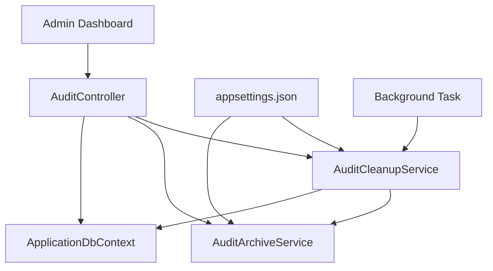

# 📋 Documentation - Stratégie de Rétention des Logs d'Audit

## 📑 Table des Matières

1. [Vue d'ensemble](#vue-densemble)
2. [Architecture du système](#architecture-du-système)
3. [Stratégies de rétention](#stratégies-de-rétention)
4. [Configuration](#configuration)
5. [Services implémentés](#services-implémentés)
6. [Endpoints API](#endpoints-api)
7. [Installation et déploiement](#installation-et-déploiement)
8. [Utilisation](#utilisation)
9. [Monitoring et surveillance](#monitoring-et-surveillance)
10. [Dépannage](#dépannage)
11. [Bonnes pratiques](#bonnes-pratiques)

---

## 🎯 Vue d'ensemble

### Objectif
Le système de rétention des logs d'audit de LibraryAPI permet de gérer automatiquement la croissance de la base de données d'audit en appliquant des politiques de rétention différenciées selon le type d'action logguée.

### Problématiques résolues
- **Croissance incontrôlée** de la base de données d'audit
- **Performance dégradée** due au volume de logs
- **Conformité réglementaire** avec des durées de rétention appropriées
- **Gestion manuelle** fastidieuse des anciens logs
- **Perte d'informations critiques** par suppression uniforme

### Fonctionnalités principales
- ✅ **Nettoyage automatique** avec service en arrière-plan
- ✅ **Politiques différenciées** par type d'action
- ✅ **Archivage optionnel** avant suppression
- ✅ **Contrôle administrateur** via API REST
- ✅ **Monitoring en temps réel** des statistiques
- ✅ **Export et sauvegarde** des logs critiques

---

## 🏗️ Architecture du système

### Composants principaux



### Services implémentés

| Service | Responsabilité | Type |
|---------|---------------|------|
| `AuditCleanupService` | Nettoyage automatique en arrière-plan | BackgroundService |
| `AuditArchiveService` | Archivage et export des logs | Scoped Service |
| `AuditController` | API REST pour contrôle manuel | Controller |

---

## 📊 Stratégies de rétention

### Matrice de rétention par type d'action

| **Catégorie** | **Type d'Action** | **Durée** | **Justification** |
|---------------|-------------------|-----------|-------------------|
| **🔐 Authentification** | `LOGIN_SUCCESS` | 6 mois | Détection d'intrusions, patterns suspects |
| | `LOGIN_FAILED` | 6 mois | Analyse des tentatives d'attaque |
| | `LOGOUT` | 3 mois | Moins critique, volume élevé |
| | `REGISTER` | 1 an | Traçabilité des inscriptions |
| **👤 Profil** | `PROFILE_UPDATED` | 1 an | Traçabilité utilisateur, conformité |
| | `PASSWORD_CHANGED` | 1 an | Sécurité, audit des changements |
| **📚 Métier Critical** | `BOOK_CREATED` | 2 ans | Audit métier important |
| | `BOOK_UPDATED` | 2 ans | Traçabilité des modifications |
| | `BOOK_DELETED` | 2 ans | Récupération possible, conformité |
| | `BOOK_RATED` | 1 an | Analyse qualité, statistiques |
| | `BOOK_COMMENTED` | 1 an | Modération, traçabilité contenu |
| **📖 Usage Normal** | `BOOK_DOWNLOADED` | 3 mois | Volume élevé, moins critique |
| | `BOOK_VIEWED` | 1 mois | Très volumineux, statistiques courtes |
| **❤️ Favoris** | `FAVORITE_ADDED` | 3 mois | Données utilisateur, volume moyen |
| | `FAVORITE_REMOVED` | 3 mois | Symétrie avec ajout |
| **🔒 Sécurité** | `UNAUTHORIZED_ACCESS` | 1 an | Conformité sécurité, investigation |
| | `RATE_LIMIT_EXCEEDED` | 3 mois | Détection d'abus, volume élevé |
| | `SUSPICIOUS_ACTIVITY` | 1 an | Investigation, conformité |
| | `TOKEN_EXPIRED` | 3 mois | Debug, maintenance |
| **⚙️ Système** | `SYSTEM_ERROR` | 1 an | Debug, amélioration continue |
| | `SYSTEM_STARTUP` | 3 mois | Monitoring, redémarrages |
| | `SYSTEM_SHUTDOWN` | 3 mois | Monitoring, maintenance |
| **👑 Administration** | `USER_ROLE_CHANGED` | 2 ans | Audit critique, conformité |
| | `USER_DELETED` | 2 ans | Récupération, investigation |
| | `NOTIFICATION_SENT` | 6 mois | Communication, debug |
| | `AUDIT_CLEANUP` | 2 ans | Meta-audit, traçabilité système |
| **🔧 Par défaut** | `DEFAULT` | 6 mois | Actions non catégorisées |

### Logique de rétention

#### 🎯 Critères de classification
1. **Criticité métier** : Plus l'action impacte le business, plus la rétention est longue
2. **Volume attendu** : Actions fréquentes = rétention plus courte
3. **Valeur légale/audit** : Conformité réglementaire et investigation
4. **Capacité de récupération** : Possibilité de reconstituer l'information

#### 📈 Stratégie de volumétrie
- **Actions critiques** (2 ans) : ~1% du volume total
- **Actions importantes** (1 an) : ~10% du volume total
- **Actions courantes** (3-6 mois) : ~30% du volume total
- **Actions fréquentes** (1 mois) : ~59% du volume total

---

## ⚙️ Configuration

### Configuration dans appsettings.json

```json
{
  "AuditSettings": {
    "RetentionPolicies": {
      "LOGIN_SUCCESS": 180,
      "LOGIN_FAILED": 180,
      "LOGOUT": 90,
      "REGISTER": 365,
      "PROFILE_UPDATED": 365,
      "PASSWORD_CHANGED": 365,
      "BOOK_CREATED": 730,
      "BOOK_UPDATED": 730,
      "BOOK_DELETED": 730,
      "BOOK_RATED": 365,
      "BOOK_COMMENTED": 365,
      "BOOK_DOWNLOADED": 90,
      "BOOK_VIEWED": 30,
      "FAVORITE_ADDED": 90,
      "FAVORITE_REMOVED": 90,
      "UNAUTHORIZED_ACCESS": 365,
      "RATE_LIMIT_EXCEEDED": 90,
      "SUSPICIOUS_ACTIVITY": 365,
      "TOKEN_EXPIRED": 90,
      "SYSTEM_ERROR": 365,
      "SYSTEM_STARTUP": 90,
      "SYSTEM_SHUTDOWN": 90,
      "USER_ROLE_CHANGED": 730,
      "USER_DELETED": 730,
      "NOTIFICATION_SENT": 180,
      "AUDIT_CLEANUP": 730,
      "DEFAULT": 180
    },
    "CleanupEnabled": true,
    "CleanupIntervalHours": 24,
    "ArchiveBeforeDelete": false,
    "ArchivePath": "archives/audit",
    "ArchiveFormat": "JSON",
    "CompressArchives": false,
    "BatchSize": 1000,
    "MaxConcurrentCleanupTasks": 3,
    "AlertOnLargeCleanup": true,
    "LargeCleanupThreshold": 10000,
    "LogCleanupStatistics": true,
    "ArchiveRetentionDays": 1095,
    "AutoCleanupArchives": true,
    "MaxArchiveSizeMB": 100
  }
}
```

### Paramètres de configuration détaillés

| **Paramètre** | **Description** | **Valeur par défaut** | **Exemple** |
|---------------|-----------------|----------------------|-------------|
| `RetentionPolicies` | Durées de rétention par action (jours) | Voir matrice | `"LOGIN": 180` |
| `CleanupEnabled` | Active/désactive le nettoyage auto | `true` | `true/false` |
| `CleanupIntervalHours` | Intervalle entre nettoyages | `24` | `24` (quotidien) |
| `ArchiveBeforeDelete` | Archive avant suppression | `false` | `true/false` |
| `ArchivePath` | Dossier de stockage des archives | `"archives/audit"` | `"/data/backups"` |
| `ArchiveFormat` | Format d'export | `"JSON"` | `"JSON"/"CSV"` |
| `CompressArchives` | Compression des archives | `false` | `true/false` |
| `BatchSize` | Taille des lots de suppression | `1000` | `500-5000` |
| `MaxConcurrentCleanupTasks` | Tâches parallèles max | `3` | `1-10` |
| `AlertOnLargeCleanup` | Alerte si gros nettoyage | `true` | `true/false` |
| `LargeCleanupThreshold` | Seuil d'alerte | `10000` | `1000-100000` |
| `LogCleanupStatistics` | Log des statistiques | `true` | `true/false` |
| `ArchiveRetentionDays` | Rétention des archives | `1095` (3 ans) | `365-3650` |
| `AutoCleanupArchives` | Nettoyage auto des archives | `true` | `true/false` |
| `MaxArchiveSizeMB` | Taille max par archive | `100` | `10-1000` |

---

## 🔧 Services implémentés

### 1. AuditCleanupService (BackgroundService)

#### Responsabilités
- **Nettoyage automatique** selon les politiques configurées
- **Exécution en arrière-plan** 24h/24
- **Gestion des erreurs** et récupération automatique
- **Logging détaillé** de toutes les opérations
- **Audit des nettoyages** (meta-audit)

#### Fonctionnement
```csharp
// Cycle de nettoyage automatique
┌─────────────────────────────────────────────┐
│ 1. Attendre intervalle (24h par défaut)    │
│ 2. Charger politiques de rétention         │
│ 3. Pour chaque politique :                 │
│    - Identifier logs éligibles             │
│    - Archiver si configuré                 │
│    - Supprimer de la base                  │
│ 4. Créer log d'audit du nettoyage          │
│ 5. Logger statistiques                     │
└─────────────────────────────────────────────┘
```

#### Gestion d'erreurs
- **Retry automatique** avec délai exponentiel
- **Isolation des erreurs** par politique
- **Continuation** même en cas d'échec partiel
- **Alertes** en cas d'échec critique

### 2. AuditArchiveService

#### Responsabilités
- **Archivage** des logs avant suppression
- **Export multiple formats** (CSV, JSON)
- **Compression optionnelle** (gzip)
- **Métadonnées enrichies** dans les archives
- **Gestion du cycle de vie** des archives

#### Formats d'export supportés

##### Format CSV
```csv
Id,UserId,Action,Message,CreatedAt,IpAddress
1,"user123","LOGIN_SUCCESS","Connexion réussie","2024-01-15 10:30:00","192.168.1.100"
2,"user456","BOOK_DOWNLOADED","Téléchargement livre ID 42","2024-01-15 10:35:00","10.0.0.15"
```

##### Format JSON
```json
{
  "metadata": {
    "actionType": "LOGIN_SUCCESS",
    "cutoffDate": "2024-01-15T00:00:00Z",
    "archiveDate": "2024-08-15T12:00:00Z",
    "logCount": 1500,
    "statistics": {
      "totalLogs": 1500,
      "uniqueUsers": 245,
      "uniqueActions": 8,
      "topActions": {
        "LOGIN_SUCCESS": 800,
        "LOGIN_FAILED": 200
      }
    }
  },
  "logs": [
    {
      "id": 1,
      "userId": "user123",
      "action": "LOGIN_SUCCESS",
      "message": "Connexion réussie",
      "createdAt": "2024-01-15T10:30:00Z",
      "ipAddress": "192.168.1.100"
    }
  ]
}
```

### 3. AuditController (API REST)

#### Endpoints disponibles

| **Endpoint** | **Méthode** | **Description** | **Rôle requis** |
|--------------|-------------|-----------------|-----------------|
| `/api/admin/audit/logs` | GET | Liste paginée des logs | Admin |
| `/api/admin/audit/stats` | GET | Statistiques rapides | Admin |
| `/api/admin/audit/database-size` | GET | Analyse détaillée de la base | Admin |
| `/api/admin/audit/cleanup` | POST | Nettoyage manuel | Admin |
| `/api/admin/audit/force-cleanup` | POST | Force nettoyage auto | Admin |
| `/api/admin/audit/retention-config` | GET | Configuration actuelle | Admin |
| `/api/admin/audit/archives` | GET | Liste des archives | Admin |
| `/api/admin/audit/archives/download/{fileName}` | GET | Télécharge archive | Admin |
| `/api/admin/audit/archives/cleanup` | DELETE | Nettoie anciennes archives | Admin |
| `/api/admin/audit/search` | GET | Recherche dans les logs | Admin |
| `/api/admin/audit/export` | POST | Export personnalisé | Admin |

---

## 🚀 Installation et déploiement

### 1. Fichiers à créer

#### Nouveaux fichiers
```
src/
├── Services/
│   ├── AuditCleanupService.cs      # Service de nettoyage automatique
│   └── AuditArchiveService.cs      # Service d'archivage
└── Models/DTOs/
    └── CleanupRequest.cs           # Modèles pour les requêtes
```

#### Fichiers à modifier
```
src/
├── Program.cs                      # Ajout des services
├── appsettings.json               # Configuration des politiques
└── Controllers/Admin/
    └── AuditController.cs         # Extension avec nouveaux endpoints
```

### 2. Modifications de Program.cs

```csharp
// Ajouter après builder.Services.AddScoped<AuditLogger>();
builder.Services.AddScoped<AuditArchiveService>();
builder.Services.AddHostedService<AuditCleanupService>();
```

### 3. Structure des dossiers créés automatiquement

```
Projet/
├── archives/
│   └── audit/
│       ├── audit_archive_LOGIN_20240815_120000.json
│       ├── audit_archive_BOOK_VIEWED_20240815_120100.csv
│       └── ...
└── logs/
    ├── app-20240815.log
    ├── errors-20240815.log
    └── ...
```

### 4. Permissions requises

- **Lecture/écriture** sur le dossier `archives/audit/`
- **Accès base de données** avec droits DELETE sur table `AuditLogs`
- **Exécution de tâches en arrière-plan** (BackgroundService)

---

## 💻 Utilisation

### Nettoyage automatique

Le service de nettoyage s'exécute automatiquement selon la configuration :

```json
{
  "AuditSettings": {
    "CleanupEnabled": true,
    "CleanupIntervalHours": 24
  }
}
```

#### Logs du nettoyage automatique
```
[12:00:00 INF] 🧹 Début du nettoyage des logs d'audit à 2024-08-15 12:00:00
[12:00:05 INF] 🗑️ 1500 logs BOOK_VIEWED marqués pour suppression (> 30 jours)
[12:00:10 INF] 🗑️ 800 logs BOOK_DOWNLOADED marqués pour suppression (> 90 jours)
[12:00:15 INF] ✅ Nettoyage terminé : 2300 logs supprimés en 15234ms
[12:00:15 INF] 📊 BOOK_VIEWED: 1500 logs supprimés
[12:00:15 INF] 📊 BOOK_DOWNLOADED: 800 logs supprimés
```

### Contrôle manuel via API

#### 1. Aperçu avant suppression
```bash
curl -X POST "https://localhost:5001/api/admin/audit/cleanup" \
  -H "Authorization: Bearer YOUR_JWT_TOKEN" \
  -H "Content-Type: application/json" \
  -d '{
    "retentionDays": 90,
    "previewOnly": true
  }'
```

**Réponse :**
```json
{
  "message": "Aperçu : 2300 logs seraient supprimés",
  "deletedCount": 2300,
  "cutoffDate": "2024-05-15T12:00:00Z",
  "detailedStats": {
    "BOOK_VIEWED": 1500,
    "BOOK_DOWNLOADED": 800
  },
  "durationMs": 145.7,
  "isPreview": true
}
```

#### 2. Nettoyage avec archivage
```bash
curl -X POST "https://localhost:5001/api/admin/audit/cleanup" \
  -H "Authorization: Bearer YOUR_JWT_TOKEN" \
  -H "Content-Type: application/json" \
  -d '{
    "retentionDays": 60,
    "actionType": "BOOK_VIEWED",
    "archiveBeforeDelete": true,
    "previewOnly": false
  }'
```

#### 3. Statistiques de la base de données
```bash
curl -X GET "https://localhost:5001/api/admin/audit/database-size" \
  -H "Authorization: Bearer YOUR_JWT_TOKEN"
```

**Réponse détaillée :**
```json
{
  "totalLogs": 125000,
  "logsLast7Days": 15000,
  "logsLast30Days": 62000,
  "oldestLog": "2023-08-15T10:00:00Z",
  "newestLog": "2024-08-15T12:00:00Z",
  "topActions": [
    {
      "action": "BOOK_VIEWED",
      "count": 45000,
      "percentage": 36.0,
      "firstOccurrence": "2023-08-15T10:00:00Z",
      "lastOccurrence": "2024-08-15T11:59:00Z"
    },
    {
      "action": "BOOK_DOWNLOADED",
      "count": 28000,
      "percentage": 22.4
    }
  ],
  "monthlyDistribution": [
    {
      "yearMonth": "2024-08",
      "count": 15000,
      "topActionsThisMonth": ["BOOK_VIEWED", "LOGIN_SUCCESS", "BOOK_DOWNLOADED"]
    }
  ],
  "sizeEstimate": {
    "estimatedSizeKB": 15625,
    "averageSizePerLog": 128.5,
    "dailyGrowthKB": 312.5,
    "predicted30DaysKB": 9375
  }
}
```

#### 4. Gestion des archives
```bash
# Lister les archives
curl -X GET "https://localhost:5001/api/admin/audit/archives" \
  -H "Authorization: Bearer YOUR_JWT_TOKEN"

# Télécharger une archive
curl -X GET "https://localhost:5001/api/admin/audit/archives/download/audit_archive_LOGIN_20240815_120000.json" \
  -H "Authorization: Bearer YOUR_JWT_TOKEN" \
  --output "audit_backup.json"

# Nettoyer les anciennes archives (+ de 1 an)
curl -X DELETE "https://localhost:5001/api/admin/audit/archives/cleanup?maxAgeDays=365" \
  -H "Authorization: Bearer YOUR_JWT_TOKEN"
```

#### 5. Export personnalisé
```bash
curl -X POST "https://localhost:5001/api/admin/audit/export" \
  -H "Authorization: Bearer YOUR_JWT_TOKEN" \
  -H "Content-Type: application/json" \
  -d '{
    "startDate": "2024-01-01T00:00:00Z",
    "endDate": "2024-08-15T23:59:59Z",
    "actionType": "LOGIN",
    "format": "CSV",
    "compress": false,
    "maxRecords": 10000
  }' \
  --output "login_export.csv"
```

---

## 📊 Monitoring et surveillance

### Métriques clés à surveiller

#### 1. Volume et croissance
- **Nombre total de logs** : Surveillance de la croissance
- **Logs par jour** : Détection de pics d'activité
- **Taille estimée de la base** : Planification de capacité
- **Croissance quotidienne** : Prédiction des besoins

#### 2. Performance du nettoyage
- **Durée des nettoyages** : Détection de ralentissements
- **Nombre de logs supprimés** : Efficacité des politiques
- **Erreurs de nettoyage** : Problèmes techniques
- **Fréquence des nettoyages** : Respect de la planification

#### 3. Archives
- **Nombre d'archives** : Accumulation
- **Taille des archives** : Espace disque
- **Âge des archives** : Politique de rétention

### Dashboard de monitoring

```bash
# Statistiques rapides pour dashboard
curl -X GET "https://localhost:5001/api/admin/audit/stats" \
  -H "Authorization: Bearer YOUR_JWT_TOKEN"
```

**Réponse :**
```json
{
  "totalLogs": 125000,
  "logsToday": 2100,
  "logsLast7Days": 15000,
  "loginAttempts": 8500,
  "bookActions": 95000,
  "securityEvents": 245
}
```

### Alertes recommandées

#### 🚨 Alertes critiques
- **Échec du nettoyage automatique** pendant > 48h
- **Croissance > 50% par rapport à la normale**
- **Espace disque < 10%** sur les archives
- **Erreurs répétées** dans le service de nettoyage

#### ⚠️ Alertes d'information
- **Nettoyage > 10 000 logs** en une fois
- **Archive > 100 MB** créée
- **Politique de rétention** non définie pour une nouvelle action

### Logs de surveillance

#### Structure des logs Serilog
```
[12:00:00 INF] 🧹 AuditCleanupService initialized - Enabled: True, Interval: 24h, Archive: False
[12:00:00 INF] 🚀 Démarrage du service de nettoyage automatique des logs d'audit
[13:00:00 INF] 🧹 Début du nettoyage des logs d'audit à 2024-08-15 13:00:00
[13:00:05 INF] 🔍 Vérification des logs BOOK_VIEWED antérieurs au 2024-07-15 13:00:00 (30 jours)
[13:00:08 INF] 🗑️ 1500 logs BOOK_VIEWED marqués pour suppression (> 30 jours)
[13:00:15 INF] ✅ Nettoyage terminé : 2300 logs supprimés en 15234ms
[13:00:15 INF] 📊 Email sending completed - Sent: 1, Skipped: 0, Failed: 0
```

---

## 🛠️ Dépannage

### Problèmes courants

#### 1. Service de nettoyage ne démarre pas

**Symptômes :**
- Aucun log de démarrage du `AuditCleanupService`
- Logs d'audit s'accumulent sans être nettoyés

**Causes possibles :**
- Service non enregistré dans `Program.cs`
- Configuration `CleanupEnabled: false`
- Erreur au démarrage du service

**Solutions :**
```csharp
// Vérifier dans Program.cs
builder.Services.AddHostedService<AuditCleanupService>();

// Vérifier dans appsettings.json
{
  "AuditSettings": {
    "CleanupEnabled": true
  }
}

// Vérifier les logs Serilog pour erreurs de démarrage
```

#### 2. Erreurs de permissions sur les archives

**Symptômes :**
```
[ERROR] Erreur lors de l'archivage des logs LOGIN: System.UnauthorizedAccessException
```

**Solutions :**
```bash
# Créer le dossier avec bonnes permissions
sudo mkdir -p /path/to/archives/audit
sudo chown -R www-data:www-data /path/to/archives
sudo chmod -R 755 /path/to/archives

# Ou configurer un chemin accessible
{
  "AuditSettings": {
    "ArchivePath": "./archives/audit"
  }
}
```

#### 3. Nettoyage trop agressif

**Symptômes :**
- Perte de logs importants
- Durées de rétention trop courtes

**Solutions :**
```json
{
  "AuditSettings": {
    "ArchiveBeforeDelete": true,
    "RetentionPolicies": {
      "BOOK_CREATED": 1095,  // Augmenter à 3 ans
      "DEFAULT": 365         // Augmenter par défaut à 1 an
    }
  }
}
```

#### 4. Performance dégradée du nettoyage

**Symptômes :**
- Nettoyages très longs (> 1 minute)
- Timeouts de base de données

**Solutions :**
```json
{
  "AuditSettings": {
    "BatchSize": 500,                    // Réduire la taille des lots
    "MaxConcurrentCleanupTasks": 1,      // Réduire la parallélisation
    "CleanupIntervalHours": 6            // Nettoyer plus souvent
  }
}
```

#### 5. Archives trop volumineuses

**Symptômes :**
- Fichiers d'archive > 100 MB
- Espace disque insuffisant

**Solutions :**
```json
{
  "AuditSettings": {
    "CompressArchives": true,        // Activer la compression
    "MaxArchiveSizeMB": 50,         // Réduire la taille max
    "ArchiveRetentionDays": 730     // Réduire la rétention des archives
  }
}
```

### Diagnostics

#### Vérification de l'état du système
```bash
# 1. Vérifier la configuration
curl -X GET "https://localhost:5001/api/admin/audit/retention-config" \
  -H "Authorization: Bearer YOUR_JWT_TOKEN"

# 2. Analyser les statistiques
curl -X GET "https://localhost:5001/api/admin/audit/database-size" \
  -H "Authorization: Bearer YOUR_JWT_TOKEN"

# 3. Tester un nettoyage en preview
curl -X POST "https://localhost:5001/api/admin/audit/cleanup" \
  -H "Authorization: Bearer YOUR_JWT_TOKEN" \
  -d '{"retentionDays": 30, "previewOnly": true}'

# 4. Forcer un nettoyage pour tester
curl -X POST "https://localhost:5001/api/admin/audit/force-cleanup" \
  -H "Authorization: Bearer YOUR_JWT_TOKEN"
```

#### Analyse des logs Serilog
```bash
# Logs généraux
tail -f logs/app-$(date +%Y%m%d).log | grep -i audit

# Logs d'erreurs uniquement
tail -f logs/errors-$(date +%Y%m%d).log | grep -i cleanup

# Recherche de patterns spécifiques
grep "🧹\|🗑️\|✅\|❌" logs/app-*.log | tail -20
```

---

## ✅ Bonnes pratiques

### Configuration recommandée par environnement

#### 🔧 Développement
```json
{
  "AuditSettings": {
    "CleanupEnabled": true,
    "CleanupIntervalHours": 6,     // Plus fréquent pour tests
    "ArchiveBeforeDelete": true,   // Sécurité pendant développement
    "RetentionPolicies": {
      "DEFAULT": 30                // Très court pour tests
    }
  }
}
```

#### 🏭 Production - Petite échelle
```json
{
  "AuditSettings": {
    "CleanupEnabled": true,
    "CleanupIntervalHours": 24,
    "ArchiveBeforeDelete": false,  // Pas d'archivage si pas nécessaire
    "RetentionPolicies": {
      "BOOK_VIEWED": 30,
      "BOOK_DOWNLOADED": 90,
      "LOGIN_SUCCESS": 180,
      "BOOK_CREATED": 365,
      "DEFAULT": 90
    }
  }
}
```

#### 🏢 Production - Grande échelle
```json
{
  "AuditSettings": {
    "CleanupEnabled": true,
    "CleanupIntervalHours": 12,        // Nettoyage plus fréquent
    "ArchiveBeforeDelete": true,       // Archivage obligatoire
    "CompressArchives": true,          // Compression pour économiser l'espace
    "BatchSize": 5000,                 // Lots plus importants
    "MaxConcurrentCleanupTasks": 5,    // Plus de parallélisme
    "RetentionPolicies": {
      "BOOK_VIEWED": 7,                // Très court pour gros volume
      "BOOK_DOWNLOADED": 30,
      "LOGIN_SUCCESS": 180,
      "BOOK_CREATED": 730,
      "UNAUTHORIZED_ACCESS": 1095,     // Plus long pour sécurité
      "DEFAULT": 90
    }
  }
}
```

#### 🏦 Secteur régulé (Banque, Santé)
```json
{
  "AuditSettings": {
    "CleanupEnabled": true,
    "CleanupIntervalHours": 24,
    "ArchiveBeforeDelete": true,       // Archivage OBLIGATOIRE
    "CompressArchives": true,
    "ArchiveRetentionDays": 2555,      // 7 ans d'archives
    "RetentionPolicies": {
      "LOGIN_SUCCESS": 1095,           // 3 ans minimum
      "LOGIN_FAILED": 1095,
      "BOOK_CREATED": 2555,            // 7 ans pour audit métier
      "BOOK_DELETED": 2555,
      "USER_ROLE_CHANGED": 2555,
      "UNAUTHORIZED_ACCESS": 2555,
      "DEFAULT": 1095
    }
  }
}
```

### Règles de dimensionnement

#### 📊 Estimation de volumes

| **Type d'application** | **Utilisateurs actifs** | **Logs/jour estimés** | **Croissance mensuelle** | **Config recommandée** |
|------------------------|--------------------------|------------------------|--------------------------|------------------------|
| **Bibliothèque personnelle** | 1-10 | 100-1 000 | 30 KB | Rétention 3 mois |
| **Petite entreprise** | 10-100 | 1 000-10 000 | 300 KB | Rétention 6 mois |
| **Moyenne entreprise** | 100-1 000 | 10 000-100 000 | 3 MB | Rétention différenciée |
| **Grande entreprise** | 1 000+ | 100 000+ | 30 MB+ | Archivage + compression |

#### 🎯 Règles de calcul

```javascript
// Estimation du volume de logs par jour
function estimateLogVolume(activeUsers, actionsPerUserPerDay = 50) {
  const logsPerDay = activeUsers * actionsPerUserPerDay;
  const avgLogSize = 150; // octets par log
  const volumeKBPerDay = (logsPerDay * avgLogSize) / 1024;

  return {
    logsPerDay,
    volumeKBPerDay,
    volumeMBPerMonth: (volumeKBPerDay * 30) / 1024,
    volumeGBPerYear: (volumeKBPerDay * 365) / (1024 * 1024)
  };
}

// Exemple pour 500 utilisateurs actifs
console.log(estimateLogVolume(500));
// Résultat : 25 000 logs/jour, ~3.6 MB/mois, ~130 MB/an
```

### Surveillance et maintenance

#### 📈 Métriques critiques à surveiller

1. **Volume quotidien** : `logs_today / logs_yesterday`
   - **Seuil d'alerte** : Variation > ±50%
   - **Action** : Vérifier pics d'activité ou dysfonctionnements

2. **Croissance hebdomadaire** : `logs_this_week / logs_last_week`
   - **Seuil d'alerte** : Croissance > +30%
   - **Action** : Ajuster politiques de rétention

3. **Efficacité du nettoyage** : `logs_deleted / logs_eligible`
   - **Seuil d'alerte** : Efficacité < 90%
   - **Action** : Vérifier configuration et erreurs

4. **Performance** : `cleanup_duration_ms`
   - **Seuil d'alerte** : Durée > 60 000ms (1 minute)
   - **Action** : Optimiser BatchSize ou réduire parallélisme

#### 🔍 Scripts de monitoring

##### Script de vérification quotidienne
```bash
#!/bin/bash
# check-audit-health.sh

API_BASE="https://localhost:5001/api/admin/audit"
AUTH_TOKEN="YOUR_JWT_TOKEN"

echo "=== Audit Health Check $(date) ==="

# 1. Statistiques générales
echo "📊 Statistiques générales:"
curl -s -H "Authorization: Bearer $AUTH_TOKEN" \
  "$API_BASE/stats" | jq '.totalLogs, .logsToday, .logsLast7Days'

# 2. Taille de la base
echo "💾 Taille de la base:"
curl -s -H "Authorization: Bearer $AUTH_TOKEN" \
  "$API_BASE/database-size" | jq '.sizeEstimate'

# 3. Vérification des archives
echo "📦 Archives disponibles:"
curl -s -H "Authorization: Bearer $AUTH_TOKEN" \
  "$API_BASE/archives" | jq 'length'

# 4. Test de nettoyage en preview
echo "🧹 Test de nettoyage (preview):"
curl -s -H "Authorization: Bearer $AUTH_TOKEN" \
  -H "Content-Type: application/json" \
  -d '{"retentionDays": 30, "previewOnly": true}' \
  "$API_BASE/cleanup" | jq '.deletedCount'

echo "=== Fin du check ==="
```

##### Script d'alerte automatique
```bash
#!/bin/bash
# audit-alerts.sh

# Récupérer les stats
STATS=$(curl -s -H "Authorization: Bearer $AUTH_TOKEN" "$API_BASE/stats")
TOTAL_LOGS=$(echo $STATS | jq '.totalLogs')
LOGS_TODAY=$(echo $STATS | jq '.logsToday')

# Seuils d'alerte
MAX_TOTAL_LOGS=1000000
MAX_LOGS_TODAY=50000

# Vérifications
if [ $TOTAL_LOGS -gt $MAX_TOTAL_LOGS ]; then
  echo "🚨 ALERTE: Trop de logs total ($TOTAL_LOGS > $MAX_TOTAL_LOGS)"
  # Envoyer notification (email, Slack, etc.)
fi

if [ $LOGS_TODAY -gt $MAX_LOGS_TODAY ]; then
  echo "⚠️ ATTENTION: Pic d'activité aujourd'hui ($LOGS_TODAY > $MAX_LOGS_TODAY)"
fi
```

### Stratégies de migration

#### 🔄 Migration depuis un système existant

##### Étape 1 : Analyse de l'existant
```sql
-- Analyser les logs existants
SELECT
  action,
  COUNT(*) as count,
  MIN(created_at) as oldest,
  MAX(created_at) as newest,
  AVG(LENGTH(message)) as avg_message_length
FROM audit_logs
GROUP BY action
ORDER BY count DESC;
```

##### Étape 2 : Sauvegarde préventive
```bash
# Export complet avant migration
curl -X POST "https://localhost:5001/api/admin/audit/export" \
  -H "Authorization: Bearer $AUTH_TOKEN" \
  -d '{
    "format": "JSON",
    "compress": true,
    "maxRecords": 999999999
  }' \
  --output "backup_before_migration.json.gz"
```

##### Étape 3 : Migration progressive
```json
{
  "AuditSettings": {
    "CleanupEnabled": false,  // Désactiver pendant migration
    "ArchiveBeforeDelete": true,
    "RetentionPolicies": {
      "DEFAULT": 999999      // Très long pendant tests
    }
  }
}
```

##### Étape 4 : Validation
```bash
# 1. Test en preview uniquement
curl -X POST "$API_BASE/cleanup" \
  -d '{"retentionDays": 90, "previewOnly": true}'

# 2. Test sur petit échantillon
curl -X POST "$API_BASE/cleanup" \
  -d '{"retentionDays": 30, "actionType": "BOOK_VIEWED", "archiveBeforeDelete": true}'

# 3. Validation des archives
curl -X GET "$API_BASE/archives"
```

#### 🚀 Déploiement en production

##### Checklist de déploiement
- [ ] **Configuration validée** en environnement de test
- [ ] **Permissions correctes** sur dossiers d'archives
- [ ] **Sauvegarde complète** de la base d'audit
- [ ] **Monitoring activé** (logs, métriques)
- [ ] **Alertes configurées** (email, Slack)
- [ ] **Tests de nettoyage** en preview réussis
- [ ] **Documentation** mise à jour pour l'équipe

##### Déploiement progressif
```yaml
# Semaine 1 : Mode observation
AuditSettings:
  CleanupEnabled: false
  ArchiveBeforeDelete: true

# Semaine 2 : Nettoyage conservateur
AuditSettings:
  CleanupEnabled: true
  CleanupIntervalHours: 168  # 1 semaine
  RetentionPolicies:
    DEFAULT: 365             # 1 an pour tout

# Semaine 3 : Politiques différenciées
AuditSettings:
  CleanupIntervalHours: 72   # 3 jours
  RetentionPolicies:
    BOOK_VIEWED: 90
    LOGIN_SUCCESS: 180
    # etc.

# Semaine 4+ : Configuration finale
AuditSettings:
  CleanupIntervalHours: 24   # Quotidien
  # Configuration complète
```

### Optimisations de performance

#### 🏃‍♂️ Base de données

##### Index recommandés
```sql
-- Index sur CreatedAt pour les requêtes de nettoyage
CREATE INDEX IF NOT EXISTS IX_AuditLogs_CreatedAt_Action
ON AuditLogs(CreatedAt, Action);

-- Index pour les recherches par utilisateur
CREATE INDEX IF NOT EXISTS IX_AuditLogs_UserId_CreatedAt
ON AuditLogs(UserId, CreatedAt);

-- Index pour les statistiques par action
CREATE INDEX IF NOT EXISTS IX_AuditLogs_Action_CreatedAt
ON AuditLogs(Action, CreatedAt);
```

##### Partitionnement (MySQL 8.0+)
```sql
-- Partitionnement par mois pour améliorer les performances
ALTER TABLE AuditLogs
PARTITION BY RANGE (YEAR(CreatedAt) * 100 + MONTH(CreatedAt)) (
  PARTITION p202408 VALUES LESS THAN (202409),
  PARTITION p202409 VALUES LESS THAN (202410),
  PARTITION p202410 VALUES LESS THAN (202411),
  -- etc.
);
```

#### ⚡ Configuration applicative

##### Optimisation du service de nettoyage
```json
{
  "AuditSettings": {
    "BatchSize": 2000,                    // Lots plus gros si performance OK
    "MaxConcurrentCleanupTasks": 3,       // Parallélisme limité
    "CleanupIntervalHours": 12,           // Plus fréquent = lots plus petits
    "UseTransactions": true,              // Cohérence vs performance
    "SkipArchiveForLargeCleanup": true    // Skip archivage si > seuil
  }
}
```

##### Pool de connexions
```csharp
// Dans Program.cs
builder.Services.AddDbContext<ApplicationDbContext>(options =>
    options.UseMySql(connectionString, serverVersion, o =>
    {
        o.CommandTimeout(300);  // 5 minutes pour gros nettoyages
    }));
```

### Sécurité et conformité

#### 🔐 Contrôles de sécurité

##### Validation des permissions
```csharp
// Middleware de validation pour endpoints d'audit
public class AuditSecurityMiddleware
{
    public async Task InvokeAsync(HttpContext context, RequestDelegate next)
    {
        if (context.Request.Path.StartsWithSegments("/api/admin/audit"))
        {
            // Vérifications supplémentaires
            var userId = context.User.FindFirst(ClaimTypes.NameIdentifier)?.Value;
            var action = context.Request.Method + " " + context.Request.Path;

            // Log de l'accès aux fonctions d'audit
            await LogAuditAccess(userId, action, context.Connection.RemoteIpAddress);
        }

        await next(context);
    }
}
```

##### Rotation des archives
```bash
#!/bin/bash
# rotate-audit-archives.sh
# Script de rotation sécurisée des archives

ARCHIVE_DIR="/secure/audit/archives"
BACKUP_DIR="/secure/audit/backup"
MAX_AGE_DAYS=2555  # 7 ans

# 1. Chiffrement des archives anciennes
find $ARCHIVE_DIR -name "*.json" -mtime +365 -exec gpg --encrypt {} \;

# 2. Déplacement vers stockage sécurisé
find $ARCHIVE_DIR -name "*.gpg" -exec mv {} $BACKUP_DIR/ \;

# 3. Nettoyage des archives très anciennes
find $BACKUP_DIR -name "*.gpg" -mtime +$MAX_AGE_DAYS -delete

# 4. Audit du processus de rotation
echo "$(date): Rotation completed - $(ls $BACKUP_DIR | wc -l) archives secured"
```

#### 📋 Conformité RGPD

##### Droit à l'oubli
```csharp
// Endpoint pour suppression des données utilisateur
[HttpDelete("user/{userId}/gdpr-cleanup")]
[Authorize(Roles = "Admin")]
public async Task<IActionResult> GdprCleanup(string userId)
{
    // 1. Archiver les logs de l'utilisateur
    var userLogs = await _context.AuditLogs
        .Where(l => l.UserId == userId)
        .ToListAsync();

    if (userLogs.Any())
    {
        await _archiveService.ArchiveLogsAsync(userLogs, $"GDPR_USER_{userId}");
    }

    // 2. Anonymiser ou supprimer
    foreach (var log in userLogs)
    {
        log.UserId = "ANONYMIZED";
        log.Message = "GDPR - User data removed";
        log.IpAddress = "0.0.0.0";
    }

    await _context.SaveChangesAsync();

    return Ok($"GDPR cleanup completed for user {userId}");
}
```

### Tests et validation

#### 🧪 Tests unitaires

##### Test du service de nettoyage
```csharp
[Test]
public async Task CleanupService_ShouldRespectRetentionPolicies()
{
    // Arrange
    var oldLogs = CreateTestLogs("LOGIN_SUCCESS", DateTime.UtcNow.AddDays(-200));
    var recentLogs = CreateTestLogs("LOGIN_SUCCESS", DateTime.UtcNow.AddDays(-50));

    await _context.AuditLogs.AddRangeAsync(oldLogs);
    await _context.AuditLogs.AddRangeAsync(recentLogs);
    await _context.SaveChangesAsync();

    // Act
    await _cleanupService.CleanupOldLogsAsync();

    // Assert
    var remainingLogs = await _context.AuditLogs.CountAsync();
    Assert.AreEqual(recentLogs.Count, remainingLogs);
}
```

##### Test de l'archivage
```csharp
[Test]
public async Task ArchiveService_ShouldCreateValidJson()
{
    // Arrange
    var logs = CreateTestLogs("TEST_ACTION", DateTime.UtcNow.AddDays(-1));

    // Act
    var archivePath = await _archiveService.ArchiveLogsAsync(
        logs, "TEST", ArchiveFormat.JSON);

    // Assert
    Assert.IsTrue(File.Exists(archivePath));

    var jsonContent = await File.ReadAllTextAsync(archivePath);
    var deserializedLogs = JsonSerializer.Deserialize<List<ArchivedAuditLog>>(jsonContent);

    Assert.AreEqual(logs.Count, deserializedLogs.Count);
}
```

#### 🎯 Tests d'intégration

##### Script de test complet
```bash
#!/bin/bash
# integration-test.sh

API_BASE="https://localhost:5001/api/admin/audit"
AUTH_TOKEN="YOUR_JWT_TOKEN"

echo "🧪 Tests d'intégration - Système d'audit"

# Test 1: Configuration accessible
echo "Test 1: Configuration"
CONFIG=$(curl -s -H "Authorization: Bearer $AUTH_TOKEN" "$API_BASE/retention-config")
if [[ $CONFIG == *"RetentionPolicies"* ]]; then
  echo "✅ Configuration OK"
else
  echo "❌ Configuration inaccessible"
  exit 1
fi

# Test 2: Statistiques
echo "Test 2: Statistiques"
STATS=$(curl -s -H "Authorization: Bearer $AUTH_TOKEN" "$API_BASE/stats")
TOTAL=$(echo $STATS | jq '.totalLogs')
if [[ $TOTAL -gt 0 ]]; then
  echo "✅ Statistiques OK ($TOTAL logs)"
else
  echo "❌ Pas de données d'audit"
fi

# Test 3: Preview de nettoyage
echo "Test 3: Preview nettoyage"
PREVIEW=$(curl -s -H "Authorization: Bearer $AUTH_TOKEN" \
  -H "Content-Type: application/json" \
  -d '{"retentionDays": 1, "previewOnly": true}' \
  "$API_BASE/cleanup")

if [[ $PREVIEW == *"preview"* ]]; then
  echo "✅ Preview fonctionne"
else
  echo "❌ Preview échoue"
fi

# Test 4: Force cleanup (petit test)
echo "Test 4: Nettoyage forcé"
CLEANUP=$(curl -s -H "Authorization: Bearer $AUTH_TOKEN" \
  "$API_BASE/force-cleanup")

if [[ $CLEANUP == *"DeletedCount"* ]]; then
  echo "✅ Nettoyage forcé OK"
else
  echo "❌ Nettoyage forcé échoue"
fi

echo "🎉 Tests terminés"
```

---

## 📚 Annexes

### A. Glossaire

| **Terme** | **Définition** |
|-----------|----------------|
| **Audit Log** | Enregistrement d'une action utilisateur ou système pour traçabilité |
| **Rétention** | Durée de conservation d'un log avant suppression automatique |
| **Archivage** | Sauvegarde des logs dans un fichier avant suppression |
| **BackgroundService** | Service qui s'exécute en arrière-plan de l'application |
| **Politique de rétention** | Règles définissant la durée de conservation par type d'action |
| **Batch** | Lot de logs traités en une fois pour optimiser les performances |
| **Cleanup** | Processus de nettoyage/suppression des anciens logs |

### B. Codes d'erreur

| **Code** | **Description** | **Action recommandée** |
|----------|-----------------|------------------------|
| `AUDIT001` | Service de nettoyage non configuré | Vérifier `appsettings.json` |
| `AUDIT002` | Permissions insuffisantes sur archives | Vérifier droits filesystem |
| `AUDIT003` | Politique de rétention manquante | Ajouter politique pour l'action |
| `AUDIT004` | Timeout de nettoyage | Réduire `BatchSize` |
| `AUDIT005` | Archive corrompue | Vérifier intégrité du fichier |
| `AUDIT006` | Espace disque insuffisant | Libérer espace ou changer `ArchivePath` |

### C. Commandes utiles

```bash
# Surveillance en temps réel
tail -f logs/app-$(date +%Y%m%d).log | grep -E "🧹|🗑️|✅|❌"

# Statistiques rapides
curl -s -H "Authorization: Bearer $TOKEN" \
  "https://localhost:5001/api/admin/audit/stats" | jq

# Taille de la base d'audit
mysql -e "SELECT
  TABLE_NAME,
  ROUND(((data_length + index_length) / 1024 / 1024), 2) AS 'DB Size in MB'
FROM information_schema.tables
WHERE table_schema = 'librarydb' AND table_name = 'AuditLogs';"

# Nettoyage d'urgence (tous les logs > 30 jours)
curl -X POST -H "Authorization: Bearer $TOKEN" \
  -H "Content-Type: application/json" \
  -d '{"retentionDays": 30, "archiveBeforeDelete": true}' \
  "https://localhost:5001/api/admin/audit/cleanup"
```

---

## 🏁 Conclusion

Le système de rétention des logs d'audit de LibraryAPI offre une solution complète et flexible pour gérer la croissance des données d'audit tout en préservant la conformité et la traçabilité.

### Points clés à retenir

1. **Automatisation** : Le nettoyage se fait automatiquement selon les politiques configurées
2. **Flexibilité** : Politiques différenciées par type d'action pour optimiser stockage vs conformité
3. **Sécurité** : Archivage optionnel et contrôle administrateur complet
4. **Performance** : Optimisations de base de données et traitement par lots
5. **Monitoring** : Surveillance détaillée et alertes pour maintenir la santé du système

### Prochaines améliorations possibles

- **Archivage cloud** (AWS S3, Azure Blob)
- **Compression avancée** (algorithmes spécialisés)
- **Machine learning** pour prédiction de croissance
- **API GraphQL** pour requêtes complexes
- **Dashboard temps réel** avec graphiques interactifs

Cette documentation constitue le guide de référence complet pour l'utilisation et la maintenance du système de rétention des logs d'audit. 📋✨
